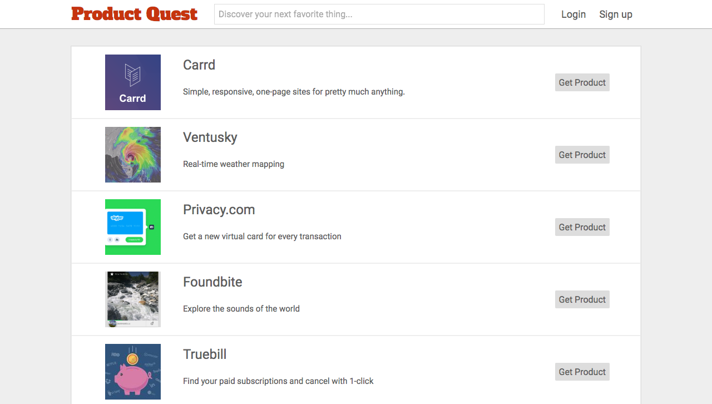

# Product Quest

[heroku]: http://www.productquest.xyz

[ProductQuest][heroku] is a full-stack web application taking inspiration from Product
Hunt. It uses Ruby on Rails for the backend with a PostgreSQL database, and
React.js on the frontend that implements a Redux framework.



## Features & Implementation

### Single-Page application

By delivering all content on one static page, ProductQuest is a single-page.
Information is passed to the frontend through API calls to controllers on
the backend. The controllers filter information passed into the single page
so that sensitive user information is not available on the frontend.

### Product Viewing and Adding

Products are stored in a database table with columns for `name`, `description`,
`image`, `hunter_id` (a foreign key to the user who added the product), and
`product_url`. On the main view of the site, viewers see an index of all
products, the `product_index` component, each with a link to the profile page of the user who added the
product.

Subsets of the full product index are rendered upon searching on the main page
as well as on user profile pages.

The `product_detail` component is rendered when a user clicks on an
item in product index. The `product_detail` component renders inside a modal
displayed on top of the content currently on the page. It shows all product
information along with the discussion section associated with the product.

### Discussion

Each comment is stored in a discussions table with columns for `author_id`,
`product_id`, and `body` (the comment's text). Comments are fetched through
ActiveRecord associations on the backend when a `product_detail` is rendered.
Each comment is rendered with the author's username, picture and title through
the product's jBuilder view:

```ruby
json.partial! "api/products/product", product: @product
json.hunter_img @product.user.image_url
json.hunter @product.user.username
json.comments do
  @product.comments.each do |comment|
    json.set! comment.id do
      json.body comment.body
      json.author User.find_by_id(comment.author_id)
    end
  end
end
```

### Search

The home view features a search bar in the bar which makes an API call to the
`ProductsController`. By passing query as a parameter to the API call, the same
index method is used to filter the products displayed on the home page.

```ruby
class Api::ProductsController
  def index
    @products = Product.all
    if params[:query] && !params[:query].empty?
      @products = @products.where(
        [
          'LOWER(name) LIKE :query OR LOWER(description) LIKE :query',
          { query: "%#{params[:query].downcase}%" }
        ]
      )
    end
  end
end
```

## Features for the Future

These are features I'm planning on implementing as I continue to work on the
project.

### Collections

With this feature, users would be able to save a product in a collections
for later viewing. The collections themselves will be a table in the database linking
collection information like name and description with the user, and there
will also be a join table linking a product with a collection. Collection
information will be rendered on user profile pages.

### Tags

Products will have tags, which will be displayed on both the `product_index`
and the `product_detail` components. Users will be able to filter products
on the main page by using these tags.
